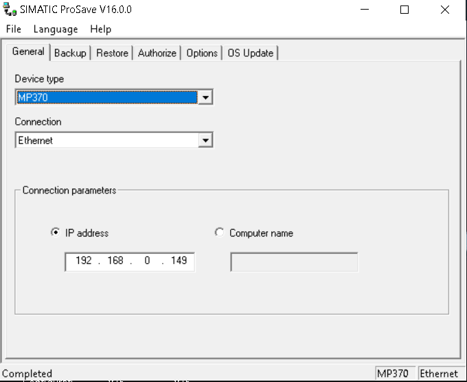

# Procedimento de Backup de IHM com SIMATIC ProSave

**Autor:** Rodolfo Silva  
**Data:** 17 de Novembro de 2025  
**Máquina:** Prensa 01

## Objetivo:

Fornecer o passo a passo para criar um backup completo de uma IHM Siemens (como as séries Basic, Comfort, ou painéis mais antigos como a linha MP/TP). Este backup é a sua **rede de segurança** e permite uma restauração rápida (rollback) para o estado funcional da IHM em caso de falha durante uma atualização, e também cumprimento do backup periódico.

---

### **Fase 1: Preparação e Configuração no ProSave**

Antes de iniciar, certifique-se de que o SIMATIC ProSave está instalado em seu computador. Ele geralmente é instalado junto com o WinCC Flexible ou TIA Portal.

1.  Abra o **SIMATIC ProSave.** 
    
2.  Selecione a aba **General**.
3.  **Device Type:** No menu suspenso, selecione o modelo exato da sua IHM (ex: "MP 370 Touch", "TP1200 Comfort").
4.  **Connection:** Escolha o método de conexão que você usará. As opções mais comuns são **Ethernet**, **MPI/PROFIBUS**, ou **USB**.

---

### **Fase 2: Configuração da Conexão (IHM e PC)**

Esta é a fase mais crítica. A configuração deve ser idêntica no PC e na IHM.

#### **Opção A: Conexão via Ethernet (Recomendado)**

1.  **No PC:**
    *   No ProSave, na aba **General**, selecione **Ethernet** como o tipo de conexão.
    *   Insira o **Endereço IP** da IHM no campo correspondente.
    *   Certifique-se de que o seu computador está na mesma faixa de rede que a IHM (ex: se a IHM é `192.168.0.10`, seu PC deve ser `192.168.0.100` com máscara de sub-rede `255.255.255.0`).

2.  **Na IHM:**
    *   Para garantir que a IHM esteja pronta para a transferência, você precisa colocá-la no modo **"Transfer"**.
    *   Reinicie a IHM. Durante a inicialização, uma tela de boot aparecerá. Pressione o botão **"Control Panel"**.
    *   Dentro do "Control Panel", clique no ícone **"Transfer Settings"** ou **"Transfer"**.
    *   Uma nova janela se abrirá. Selecione a aba **"Ethernet"** ou **"Advanced"**.
    *   Marque a opção **"Enable Transfer"** (ou "Enable Channel").
    *   **Anote o endereço IP** exibido na tela para confirmar que é o mesmo que você inseriu no ProSave.
    *   Feche a janela e volte para a tela Inicial onde as opções **"Transfer", "Start", "Control Panel" e "TaskBar"** aparece
    *   Seleciona **"Transfer"**. Somente apos entrar nesse modo, onde aparece a mensagem *"Connecting to Host"*, será possível ao ProSave se conectar a IHM
#### **Opção B: Conexão via MPI/PROFIBUS**

1.  **No PC:**
    *   Conecte seu PC à rede MPI/PROFIBUS usando um adaptador (ex: PC Adapter USB).
    *   No ProSave, na aba **General**, selecione **MPI** ou **PROFIBUS**.
    *   Insira o **Endereço MPI/DP** da IHM (um número de 0 a 126, geralmente 1 para IHMs).
    *   No painel de controle do Windows, abra o **"Set PG/PC Interface"**. Certifique-se de que a interface selecionada é o seu adaptador (ex: "PC Adapter.MPI.1") e que as propriedades da rede (velocidade, etc.) correspondem à rede da máquina.

2.  **Na IHM:**
    *   Siga os mesmos passos para entrar no modo **"Transfer"**: `Reiniciar -> Control Panel -> Transfer Settings`.
    *   Selecione a aba **"MPI/DP"**.
    *   Marque a opção **"Enable Transfer"**.
    *   Confirme o endereço do nó (Node Address) e a velocidade da rede (Baud Rate).
    *   Feche a janela e volte para a tela Inicial onde as opções **"Transfer", "Start", "Control Panel" e "TaskBar"** aparece
    *   Seleciona **"Transfer"**. Somente apos entrar nesse modo, onde aparece a mensagem *"Connecting to Host"*, será possível ao ProSave se conectar a IHM

#### **Opção C: Conexão via USB (Para Painéis Modernos)**

Este método é comum para painéis mais novos (Comfort, Basic de 2ª geração).

1.  **No PC:**
    *   No ProSave, na aba **General**, selecione **USB**.
    *   Conecte um cabo USB (geralmente tipo A para B) entre o seu PC e a IHM.

2.  **Na IHM:**
    *   Siga os mesmos passos para entrar no modo **"Transfer"**: `Reiniciar -> Control Panel -> Transfer Settings`.
    *   Selecione a aba **"USB"**.
    *   Marque a opção **"Enable Transfer"**. A IHM deve indicar que uma conexão USB está ativa.
    *   Feche a janela e volte para a tela Inicial onde as opções **"Transfer", "Start", "Control Panel" e "TaskBar"** aparece
    *   Seleciona **"Transfer"**. Somente apos entrar nesse modo, onde aparece a mensagem *"Connecting to Host"*, será possível ao ProSave se conectar a IHM

---

### **Fase 3: Execução do Backup**

Com a conexão estabelecida e a IHM em modo de transferência:

1.  No ProSave, vá para a aba **Backup**.
2.  **Data type:** Selecione **"Complete backup"**. Esta opção garante que o firmware, o projeto e os dados de receita sejam salvos.
3.  **Save as:** Clique no botão `...` e escolha um local seguro no seu computador ou HD externo para salvar o arquivo de backup. Dê um nome descritivo, como `Backup_IHM_Prensa_2025-11-17.psb`.
4.  Clique no botão **"Start Backup"**.
5.  Uma barra de progresso aparecerá no ProSave e na tela da IHM. **Não desconecte o cabo nem desligue os dispositivos** até que o processo seja concluído.
6.  Ao final, o ProSave exibirá uma mensagem de sucesso.

Após esse processo, o Backup está concluído
